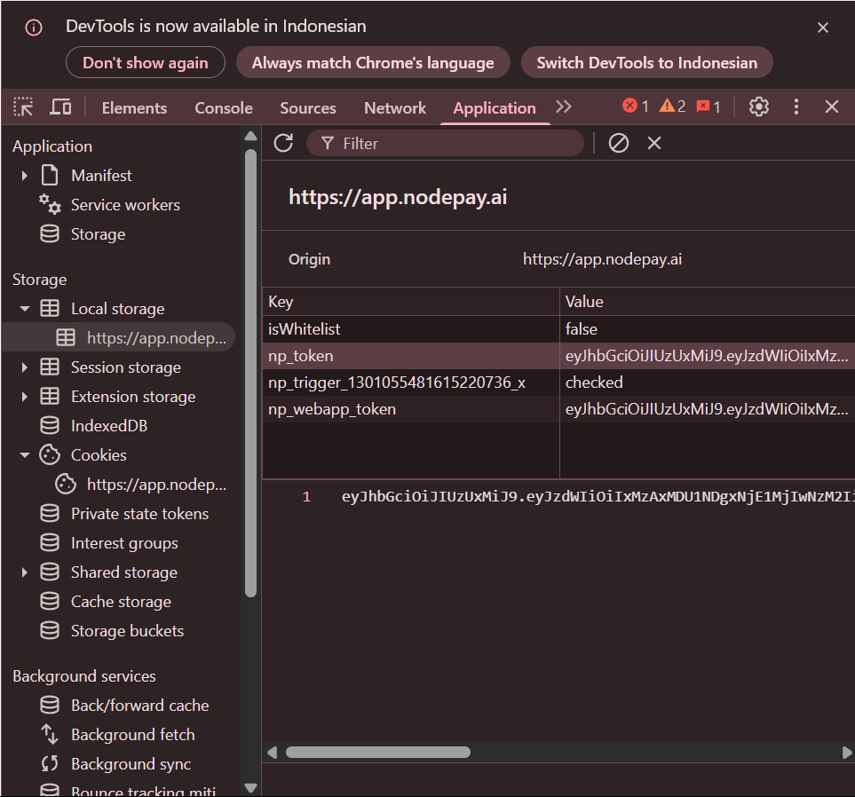

Nodepay Auto Ping 

- Đăng ký: [Nodepay](https://app.nodepay.ai/register?ref=NzsAbwy0zp8gJ2a)
- Code ref `NzsAbwy0zp8gJ2a`

## Tính năng

  - Tự động lấy thông tin tài khoản
  - Tự động chạy với proxy [Free Proxyscrape](https://proxyscrape.com/free-proxy-list) - `Option 1`
  - Tự động chạy với proxy riêng - `Option 2`
  - Tự động chạy không dùng proxy - `Option 3`
  - Tự động xoay vòng proxy - `y` hoặc `n`
  - Tự động claim daily (treo script)
  - Tự động gửi ping mỗi 55 phút
  - Chạy nhiều ví

## Yêu cầu

- Cài đặt Python3.9 trở lên và pip
- Token 2captcha 

## Hướng dẫn chạy script

1. **Tải repo về:**

2. **Cài đặt module:**
   ```bash
   pip install -r requirements.txt #hoặc pip3 install -r requirements.txt
   ```

## Config

- **accounts.json:** Tìm file `accounts.json` trong thư mục. Đảm bảo `accounts.json`. Dưới đây là ví dụ:
  ```json
    [
        {
            "Email": "your_email_address_1",
            "Password": "your_password_1"
        },
        {
            "Email": "your_email_address_2",
            "Password": "your_password_2"
        }
    ]
  ```

### Lưu ý

- Nếu không có khóa 2cpatcha,mn có thể lấy dữ liệu thủ công và đặt vào tokens.json theo định dạng.

<div style="text-align: center;">
  
</div>

- **tokens.json:** Mọi người sẽ tìm thấy file `tokens.json` trong thư mục dự án. Đảm bảo `tokens.json` chứa định dạng mà script đã setup. Dưới đây là ví dụ về định dạng file:
  ```json
    [
        {
            "Email": "your_email_address_1",
            "npToken": "your_np_token_1"
        },
        {
            "Email": "your_email_address_2",
            "npToken": "your_np_token_2"
        }
    ]
  ```

- **proxy.txt:** Mọi người sẽ tìm thấy file `proxy.txt` trong thư mục dự án. Đảm bảo `proxy.txt` chứa dữ liệu phù hợp với định dạng mà script đã setup. Dưới đây là ví dụ về định dạng file:
  ```bash
    ip:port # Giao thức mặc định HTTP.
    protocol://ip:port
    protocol://user:pass@ip:port
  ```

## Chạy script

```bash
python bot.py #hoặc python3 bot.py
```

## ỦNG HỘ MÌNH CỐC CF NẾU BẠN THÍCH SCRIPT NÀY

- **EVM:** 0x70A5a4ede89ED613307d255659a1dD837D9418a1
- **SOL:** AwXQn61FFabdV4iDjzCNTHtx2yanGDiEEh7KY4MKVZS2
- **SUI:** 0xc99395ead375fe240f0edd28acb12e3360ffe1e83bbd1d782b3208fc57fe338c

Cho mình xin một follow và một star nhé, cảm ơn bạn đã ủng hộ mình, chúc bạn cày Airdrop vui vẻ và nhớ bảo vệ tải sản của mình một cách cẩn thận nhé!

**</velhust/>**